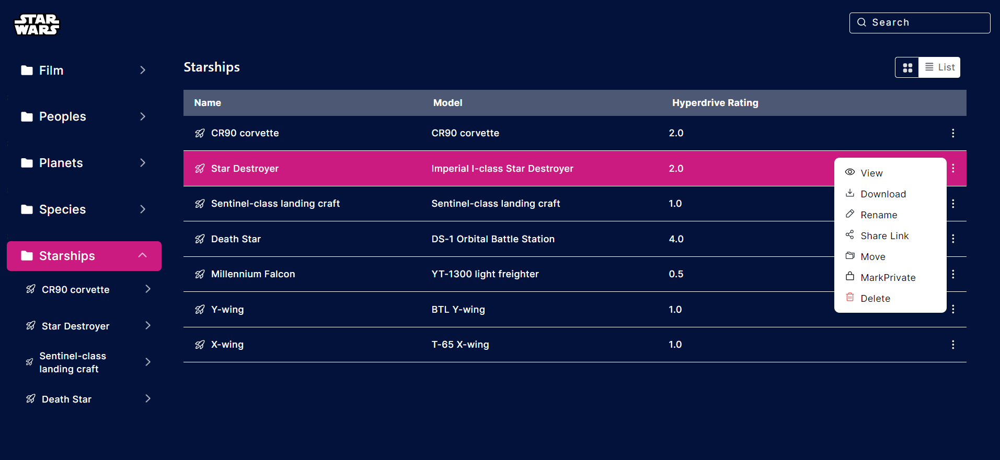

# StarWars FrontEnd Website

Welcome to the Star Wars Website! This is a full responsive and interactive project built using React.js, CSS, and the Swap API. It allows users to explore information about various elements of the Star Wars universe, including films, people, planets, species, starships, and vehicles. The website offers both grid and list layouts for viewing details of each element.

## Features
**Responsive Design**: The website is designed to be fully responsive and works seamlessly on various window screen sizes, from desktops to mobile devices.

**Sidebar Navigation**: Users can easily navigate through different sections of the Star Wars universe using the sidebar.

**Grid and List Layouts**: The website offers both grid and list layouts for displaying details of films, people, planets, species, starships, and vehicles. Users can choose their preferred layout for a better viewing experience.

**Interactive Cards**: Each element in the Star Wars universe is represented by an interactive card that displays key information. Users can click on the cards to view more details.

## Dependencies
React.js: JavaScript library for building user interfaces.

CSS: Styling the website.

Swap API: The source of data for films, people, planets, species, starships, and vehicles.

## Layout and ScreenShots
### Home Page

### Starships Page Grid View

### Starships Page List View

### Details of the card

### Different Screen Sizes

